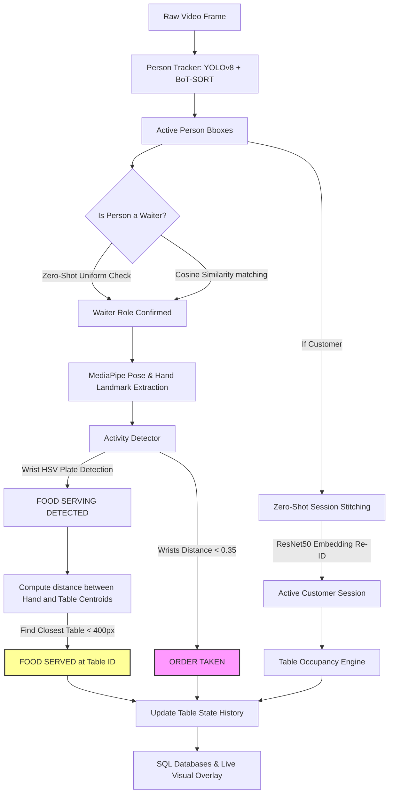

# Restaurant CCTV Analytics Pipeline

A production-grade, computer vision-based analytics engine designed to transform raw CCTV streams from restaurant environments into actionable operational metrics. The system tracks customer occupancy, evaluates table cleanliness cycle durations, monitors staff responsiveness (order taking), and logs food serving events.

---

## Core System Architecture & Workflow

The pipeline runs sequentially on each incoming video frame. The core flow is designed to maximize precision by nesting deep learning inferences inside localized crops:



---

## Technology Stack

- **Computer Vision & Inference**: OpenCV, PyTorch, Ultralytics YOLOv8, MediaPipe (Pose & Hand Landmarkers).
- **Deep Re-Identification (Re-ID)**: OSNet MSMT17 (ResNet-based extractor for visual embeddings).
- **State Machine & Logic**: Custom Finite State Machine (FSM) for table lifecycle tracking.
- **Database & Storage**: SQLAlchemy ORM, SQLite database engines.
- **Reporting & Visuals**: Python-based rendering HUD, CSV metrics exporter.

---

## Project Directory Layout

```
AI-coe-intern-project/
├── analytics/                      # Main analytical packages
│   ├── cleanliness/
│   │   ├── cleanliness_engine.py   # Vacant/occupied/dirty/clean state cycle controller
│   │   └── plate_detector.py       # Tableware detection based on ResNet crops
│   ├── config/
│   │   └── tables.json             # Table ROI polygon coordinates and center centroids
│   ├── database/
│   │   ├── database_manager.py     # SQLAlchemy manager orchestrating core metrics databases
│   │   ├── db.py                   # DB connection engine and session pooler
│   │   ├── models.py               # Database schemas and models
│   │   └── serving_event_logger.py # Performance-optimized logger for serving events
│   ├── fsm/
│   │   └── table_fsm.py            # Main FSM controller regulating table state sequences
│   ├── occupancy/
│   │   └── occupancy_engine.py     # Manages customer spatial presence and waiter assignments
│   ├── roi/
│   │   ├── table_manager.py        # Coordinates manual and ArUco camera calibrations
│   │   ├── auto_roi.py             # Dynamically clusters customer dwell patterns
│   │   └── roi_tool.py             # Interactive manual tool for drawing table ROIs
│   ├── tracking/
│   │   ├── osnet.py                # OSNet MSMT17 deep model definition
│   │   ├── person_tracker.py       # Orchestrates YOLOv8 detection and BoT-SORT tracking
│   │   ├── serving_detector.py     # Action recognition logic (order writing & plate carrying)
│   │   └── session_manager.py      # Stitches split tracks using visual similarity
│   ├── visualization/
│   │   └── renderer.py             # Renders the live overlay HUD dashboards
│   └── pipeline.py                 # Main pipeline execution entrypoint
├── configs/                        # Placeholder for shared configurations
├── datasets/                       # Placeholder for datasets and samples
├── docs/                           # Documentation and guides
├── models/                         # Localized models and estimators
├── outputs/                        # Operational outputs directory
│   ├── demo_videos/                # Sub-directory for demo and validation outputs
│   ├── reports/                    # Generated CSV logs and daily summaries
│   └── screenshots/                # Visual logs and debugging snapshots
├── scratch/                        # Sandbox for experimental scripts and classifiers
├── scripts/                        # Operational utility scripts
├── tests/                          # Automated regression tests
├── LICENSE                         # MIT License
├── README.md                       # Comprehensive guide
├── requirements.txt                # Required library list
└── .gitignore                      # Git exclusion patterns
```

---

## Setup & Installation

### 1. Prerequisite Environment
Create a clean Python environment (Python 3.10 to 3.13 recommended):
```bash
python3 -m venv .venv
source .venv/bin/activate
pip install -r requirements.txt
```

### 2. Downloading Required Weights & Assets
To keep the repository footprint light, large deep learning model files are excluded from Git. Ensure you place the following files in their respective folders:

1. **YOLOv8 Weights**: Download `yolov8n.pt` from Ultralytics and place it in the root folder of the project.
2. **OSNet Re-ID Weights**: Download `osnet_x1_0_msmt17.pth` and place it in the `embedding/` directory.
3. **MediaPipe Task Assets**: Download `pose_landmarker.task` and `hand_landmarker.task` and place them in the `embedding/` directory.

---

## Running the Project

### Running the Live CCTV Pipeline
To run the main analytics pipeline on raw restaurant CCTV footage:
```bash
# Process a 80-second window (0s to 80s) from the sample video
python analytics/pipeline.py --video "example test 2.mp4" --out outputs/demo_videos/output_validation.mp4 --tables analytics/config/tables.json --start 0 --end 80 --use-fsm
```

### Running Automated Test Suites
Verification scripts are located in `tests/` and `scratch/`:
```bash
# Verify the MediaPipe serving activity detector on sample frames
python scratch/test_serving_detector.py

# Verify the cleanliness state transition locking controls
python scratch/test_cleanliness_locking.py
```

---

## Output Metrics & Database Schema

The pipeline logs all analytical insights into three distinct SQLite databases:
1. **`restaurant_analytics.db`**: Logs customer seating, occupancy timelines, turnover stats, and FSM table state transition durations.
2. **`waiter_logs.db`**: Logs waiter order-taking (writing) timestamps and durations.
3. **`serving_logs.db`**: Logs verified serving timestamps, table attributions, and detector confidence levels.

At the end of each run, the pipeline automatically compiles operational metrics into a CSV log file export inside the `outputs/reports/` folder along with a consolidated `summary.json`.

---

## Known Limitations & Future Work

- **Extreme Occlusions**: While the visual Re-ID matching correctly stitches split tracks after brief occlusions, long-term occlusions (where the camera view is completely blocked for more than 5 minutes) will result in a new customer session.
- **Lighting and Shadows**: The uniform clothing heuristic depends partially on upper shirt brightness and lower pants darkness. Strong shadow variations can degrade zero-shot uniform check accuracy. Future enhancements should train a small classifier on top of the OSNet embeddings.
- **Auto-ROI Clustering**: The DBSCAN auto-ROI feature assumes tables stay in static positions. Active spatial re-layouts require manual recalibration via the ArUco marker board.

---

## Contributors

- **Sri Desiyan** (Lead Developer & Intern)
- **AI COE Team** (Supervisors and Framework Authors)

---

## License

This project is licensed under the MIT License - see the [LICENSE](LICENSE) file for details.
